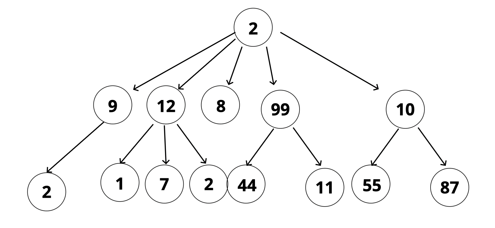
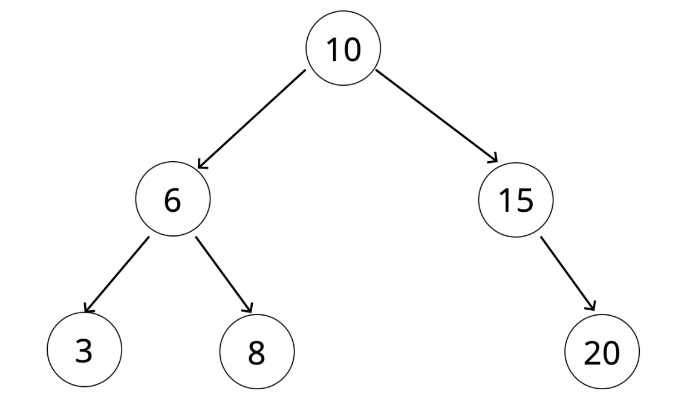
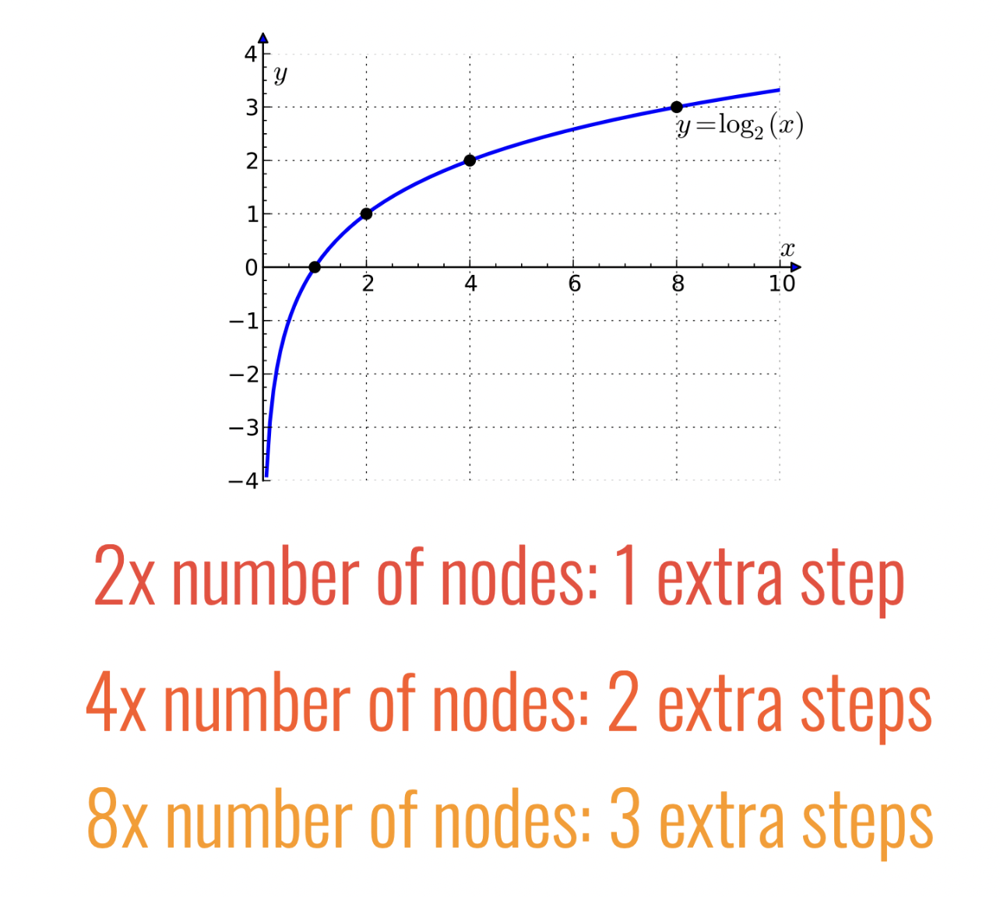

# Binary Search Trees

- [Binary Search Trees Slides](https://cs.slides.com/colt_steele/trees)

## Objectives

- Define what a tree is
- Compare and contrast trees and lists
- Explain the differences between trees, binary trees, and binary search trees (BST)
- Implement operations on binary search trees.

## What is a Tree?

- A data structure that consists of nodes in a **parent / child** relationship.



- Can store numbers or strings in a tree
- Lists: linear
  - only one path
- Trees - nonlinear
  - many different paths

---

- Singly Linked List: sort of a special case of a tree.

## Tree Terminology

|   Tree   |                                Description                                |
| :------: | :-----------------------------------------------------------------------: |
|   Root   |                          The top node in a tree.                          |
|  Child   | A node directly connected to another node when moving away from the Root. |
|  Parent  |                      The converse notion of a child.                      |
| Siblings |                  A group of nodes with the same parent.                   |
|   Leaf   |                         A node with no children.                          |
|   Edge   |               The connection between one node and another.                |

## Uses for Trees

- HTML DOM
- Network Routing
- Abstract Syntax Trees
- Artificial Intelligence
- Folders in Operating System (Folder Structure)
- Computer File Systems
- JSON

## Kinds of Trees

- Trees
- Binary Trees
  - each node can have at most 2 children (nodes)
- Binary Search Trees
  - special case of a binary tree
  - Every parent node has at most **two** children
  - sorted in a way that can be compared.
    - Every node to the left of a parent node is **always less** than the parent
    - Every node to the right of a parent node is **always greater** than the parent.



## BST Tree Classes

```js
class Node {
  constructor(val) {
    this.val = val;
    this.left = null;
    this.right = null;
  }
}

class BinarySearchTree {
  constructor() {
    this.root = null;
  }
}

let tree = new BinarySearchTree();
```

## BST Methods

- `insert`: insert a node in the tree
- `find`: find a specific node in the tree

## Big O of BST

| Insertion | Searching |
| :-------: | :-------: |
| O(log n)  | O(log n)  |

- As the number of nodes doubles, we only increase 1 extra step.
- Best Case: O(log n)



## Worst Case of BST

- Worst Case Time Complexity: **O(n)**


