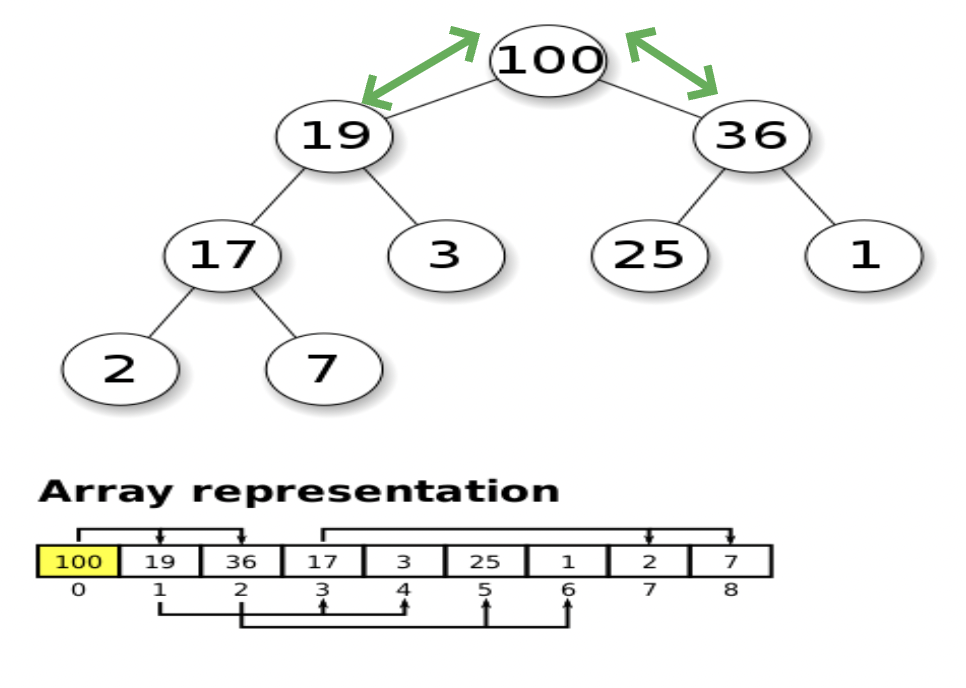

# Binary Heaps

- [Binary Heaps Slides](https://cs.slides.com/colt_steele/heaps)
- Another category of **Trees**

## Objectives

- Define what a binary heap is
- Compare and contrast min and max heaps
- Implement basic methods on heaps
- Understand where heaps are used in the real world and what other data structures can be constructed from heaps.

## What is a Binary Heap?

- Very similar to a binary search tree, but with some different rules.
- Left child is added then the right child.
- In a **MaxBinaryHeap**, parent nodes are always larger than child nodes.
- In a **MinBinaryHeap**, parent nodes are always smaller than child nodes.

## Max Binary Heap

- Each parent has at most 2 child nodes.
- The value of each parent node is always greater than its child nodes.
- In a Max Binary Heap, the parent is greater than the children, but there are no guarantees between sibling nodes.
- A binary heap is as compact as possible. All the children of **each node are as full as they can be** and **left children are filled out first**.
- No implied ordering between siblings.


<figcaption>Max Binary Heap</figcaption>


<figcaption>Min Binary Heap</figcaption>

## Why do we need to know this?

- Binary Heaps are used to implement Priority Queues, which are very commonly used data structures.
- They are also used quite a bit, with **graph traversal** algorithms.

## Storing Heaps

- There's an easy way of storing a binary heap --> list / arrays.

## Relationship between parent and left & right child

- If we have the parent node index,
  - For _any index of an array n_, the left child is stored at _2n + 1_ and the right child is at _2n + 2_.
- If we have the child node index,
  - For _any child node at index n_, its parent is at index _(n - 1) / 2_.


## Defining our Class

```
Class Name: MaxBinaryHeap
Properties: values = []
```

## Adding to a Max Binary Heap

- Added node's value is compared to the parent's value.
- Add to the end (to the left of the tree first)
- Bubble up (swap until it find its correct spot in the max binary heap tree)
  - e.g., [41, 39, 33, 18, 27, 12, 55] added 55 with parent 33
  - compare 55 and 33. since 55 > 33, swap them. [41, 39, 55, 18, 27, 12, 33]
  - compare 55 with the parent again, i.e., 41, swap again
  - Finally, [55, 39, 41, 18, 27, 12, 33]

## Insert PseudoCode

- Push the value into the values property on the heap.
- Bubble the value up to its correct spot.
  - Bubble Up:
    - Create a variable called index which is the length of the values property - 1
    - Create a variable called parentIndex which is the floor of (index - 1) / 2
    - Keep looping as long as the values element at the parentIndex is less than the values element at the child index.
      - Swap the value of the values element at the parentIndex with the value of the element property at the child index.
      - Set the index to be the parentIndex, and start over.

## Removing From a Heap

- Remove the root
- Replace with the most recently added
- Adjust (sink down)
  - The procedure for deleting the root from the heap (effectively extracting the maximum element in a max-heap or the minimum element in a min-heap) and restoring the properties.

```js
/*
[41, 39, 33, 18, 27, 12] // 41 swap with 12 then pop() 41 out and return it.
[12, 39, 33, 18, 27]  // compare 12 and 39, highest goes in front
[39, 12, 33, 18, 27] // compare 12 with its children 18 and 27, and swap with the larger children (if both are larger)
[39, 27, 33, 18, 12] // correct position now
*/
```

## Removing (`extractMax`) PseudoCode

- Swap the first value in the values property with the last one.
- Pop from the values property, so you can return the value at the end.
- Have the new root "sink down" to the correct spot
  - Your parent index starts at 0 (the root)
  - Find the index of the left child: 2 \* index + 1 (make sure its not out of bounds)
  - Find the index of the right child: 2 \* index + 2 (make sure its not out of bounds)
  - If the left or right child is greater than the element, swap. If both left and right children are larger, swap with the largest child.
  - The child index you swapped to now becomes the new parent index.
  - Keep looping and swapping until neither child is larger than the element.
  - Return the old root.

## Building a Priority Queue

- A data structure where each element has a priority.
- Elements with higher priorities are served before elements with lower priorities.
- Implement a **Min Binary Heap**

## Priority Queue PseudoCode

```
Class Name:
    Node
Properties:
    val
    priority  // only using the priority to compare and rearrange the heap

Class Name:
    PriorityQueue
Properties:
    values = []
```

- Write a Min Binary Heap - lower number means higher priority
- Each Node has a val and a priority. Use the priority to build the heap.
- **Enqueue** method accepts a value and priority, makes a new node, and puts it in the right spot based off of its priority.
- **Dequeue** method removes root element, returns it, and rearranges heap using priority.

## Big O of Binary Heaps

| Insertion | Removal  | Searching |
| :-------: | :------: | :-------: |
| O(log N)  | O(log N) |   O(N)    |

- Worst case of Insertion is still O(log N)
    - because we always insert left and right node to fill up all the nodes at the same level before moving on to the next level.

## Summary

- Binary Heaps are very useful data structures for sorting, and implementing other data structures like priority queues.
- Binary Heaps are either MaxBinaryHeaps or MinBinaryHeaps with parents either being smaller or larger than their children.
- With just a little bit of math, can represent heaps using arrays.