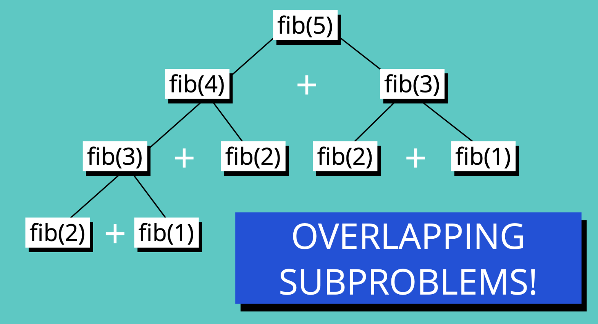
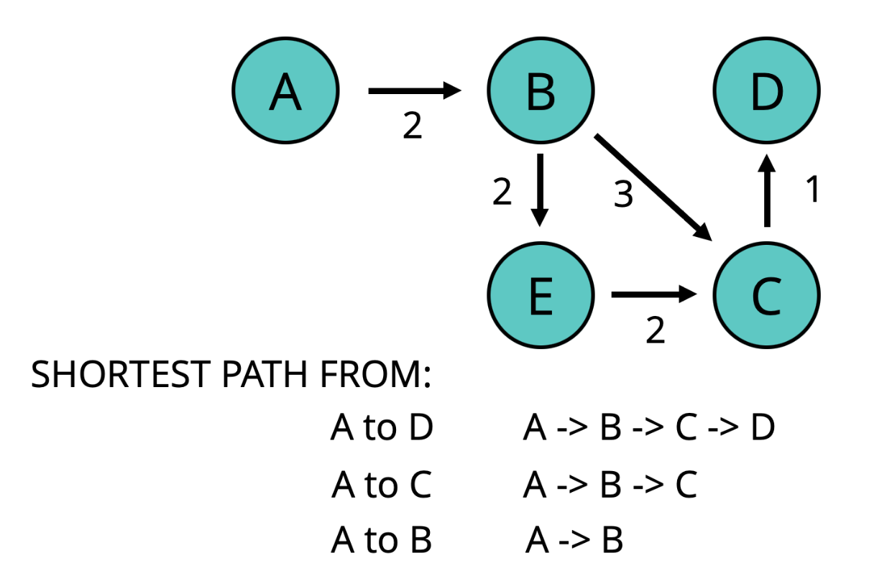

# Dynamic Programming

- [Dynamic Programming Slides](https://cs.slides.com/colt_steele/dynamic-programming)

## Objectives

- Define what dynamic programming is
- Explain what overlapping subproblems are
- Understand what optimal substructure is
- Solve more challenging problems using dynamic programming

## What is dynamic programming?

- A method for solving a complex problem by breaking it down into a collection of simpler subproblems, solving each of those subproblems just once, and storing their solutions.
- Improve performance.

## Overlapping Subproblems

- In dynamic programming, we look for overlapping subproblems.
- A problem is said to have overlapping subproblems if it can be broken down into subproblems which are reused several times.
- E.g., Fibonacci Sequence - Every number after the first two is the sum of the two preceding ones. - In the Fibonacci Sequence example below, calculation of `fib(3)` was repeated twice.
  

## Overlapping Subproblems in Merge Sort

- Merge Sort with no overlapping subproblems.
  - mergeSort([10, 24, 80, 68])
- Merge Sort with overlapping subproblems.
  - mergeSort([10, 24, 10, 24])
  - mergeSort([10, 24]) and mergeSort([10, 24])
    - solving the same subproblems, duplication!

## Optimal Substructure

- A problem is said to have optimal substructure if an optimal solution can be constructed from optimal solutions of its subproblems.
- With Optimal Substructure
  
- Without Optimal Substructure
  

## Recursive Fibonacci Sequence and it's Big O

```js
function fibonacci(n) {
  if (n <= 2) {
    return 1;
  }
  return fibonacci(n - 1) + fibonacci(n - 2);
}
```

- Time Complexity (2^N)
  - Exponential (BAD)
  - Worse than O(N^2)

## Memoization

- Storing the results of expensive function calls (e.g., fib(5)) and returning the **cached result** when the same inputs occur again.

```js
// Recursive + Memorization
function fib(n, memo = []) {
  if (memo[n] !== undefined) return memo[n];
  if (n <= 2) return 1;
  var res = fib(n - 1, memo) + fib(n - 2, memo);
  memo[n] = res;
  return res;
}
```

## Big O of Memoization

- To access a value in an array, it is O(1) time complexity.
- With memoization, we look up the value in the memo.
  - **Time Complexity: O(N)**
  - Previously, with recursion only, time complexity was O(2^N).

## Bottom Up Approach

- Previously, we were working with a Top-Down Approach.
- There is another way of doing it, i.e., Bottom Up Approach
  - work with fib(1) first

## Tabulation (Bottom Up Approach)

- Storing the result of a previous result in a "table" (usually an array).
- Usually done using **iteration**.
- Better **space complexity** can be achieved using tabulation.

```js

```

## Big O of Tabulation

- Time Complexity: O(N)
- Space Complexity is better than Memorization.