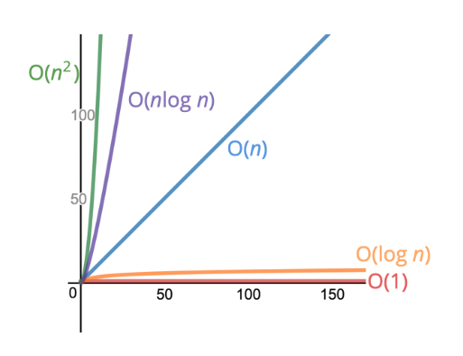
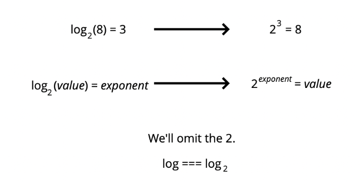
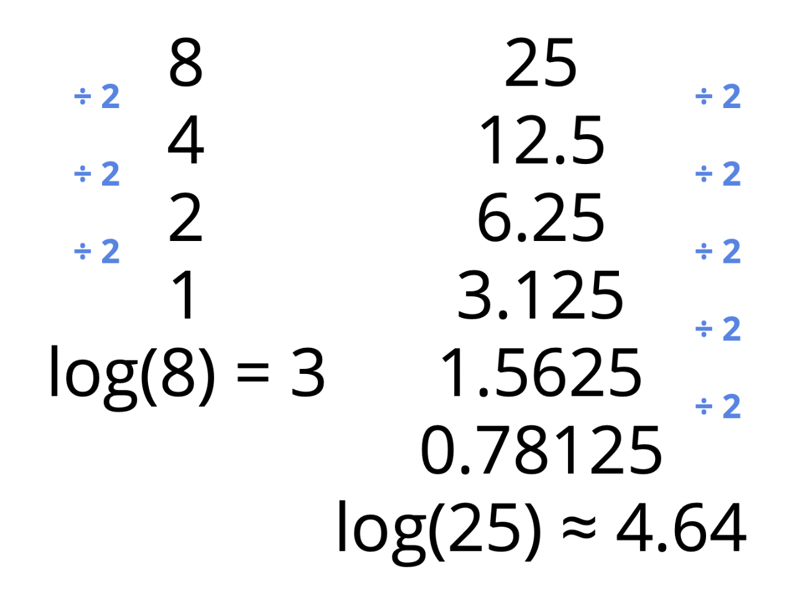

<h1 id="content">JavaScript Data Structures and Algorithms</h1>

- <a href="#big-o-notation">Big O Notation</a>
- <a href="#performance-of-arrays-and-objects">Analyzing Performance of Arrays and Objects</a>
- <a href="#problem-solving-approach">Problem Solving Approach</a>
- <a href="#problem-solving-patterns">Problem Solving Patterns</a>

<h1 id="big-o-notation">Big O Notation</h1>
<a href="#content">Back to Top</a>

<a href="https://cs.slides.com/colt_steele/big-o-notation#/2/0/1">Big O Slides</a>

## Time Complexity Examples

- Suppose we want to write a function that calculates the sum of all numbers from 1 up to (and including) some number n.

- Method 1

```js
function addUpTo(n) {
    let total = 0;
    for (let i = 1; i <= n; i++) {
        total += i
    }
    return total;
}
```

- Method 2 (a lot faster - Arithmetic)

```js
function addUpTo(n) {
    return n * (n + 1) / 2
}
```

- Which code is better?
    - Faster?
    - Less memory-intensive?
    - More readable?

- Use timer to compare the performance

```js
let t1 = performance.now();
addUpTo(100000000);
let t2 = performance.now();

console.log(`Time Elaspsed: ${(t2 - t1) / 1000} seconds.`)
```

- The problem with time
    - Different machines will record different times.
    - The same machine will record different times.
    - For fast algorithms, speed measurements may not be precise enough.

- If not time then count what?
    - Let's count the number of simple operations that computer has to perform!

- Counting Operations
    - In method 1, there are n operations because of the for loop. (n additions, n assignments)
        - `+=` and `i++`
        - `5n+2` operations
        - But regardless of the exact number, the number of operations grow proportionally with n.
    - In method 2, there are 3 operations (1 multiplication, 1 addition, 1 division) regardless of the size of n.

<a href="https://rithmschool.github.io/function-timer-demo/">Performance Tracker of the 2 Methods</a>

## Introducing Big O

- Allows us to talk formally about how the runtime of an algorithm grows as the input grows.
- Focus on the broad trends.

- **Defintion**: An algorithm is **O(f(n)) if the number of simple operations the computer has to do is eventually less than a constant times f(n), as n increases.
    - f(n) could be linear (f(n) = n)
    - f(n) could be quadratic (f(n) = n^2)
        - O(n) operation inside of an O(n) operation. (High runtime)
        - E.g. Nested for loops.
    - f(n) could be constant (f(n) = 1)
    - f(n) could be something entirely different



- Big O
    - Method 1: O(n)
    - Method 2: O(1)

- Simplifying Big O Notations
    - O(2n) --> O(n)
    - O(500) --> O(1)
    - O(13n^2) --> O(n^2)
    - O(n + 10) --> O(n)
    - O(1000n + 50) --> O(n)
    - O(n^2 + 5n + 8) --> O(n^2)

- Big O Shorthands
    - Arithmetic operations are constants. 
    - Variable assignment is constant.
    - Accessing elements in an array (by index) or object (by key) is constant
    - In a loop, the complexity is the length of the loop times the complexity of whatever happens inside of the loop.
    
## More Examples

- `O(n)`
- Maximum loop is n times.
```js
function logAtLeast5(n) {
    for (var i = 1; i <= Math.max(5, n); i++) {
        console.log(i)
    }
}
```

- `O(1)`
- Maximum loop is 5 times.
```js
function logAtMost5(n) {
    for (var i = 1; i <= Math.min(5, n); i++) {
        console.log(i)
    }
}
```

## Space Complexity

- How can we analyze the runtime of an algorithm as the size of the inputs increases?
- Can use big o notation to analyze the **space complexity**.
- How much additional memory do we need to allocate in order to run the code in our algorithm?

- **Auxiliary Space Complexity** (what we are referring to)
    - Refers to the space required by the algorithm.
    - Not including space taken up by the inputs.

- Space Complexity in JavaScript (Rules of Thumb)
    - Most primitives (booleans, numbers, undefined, null) are constant space.
    - Strings require O(n) space (where n is the string length).
    - Reference types are generally O(n), where n is the length (for arrays) or the number of keys (for objects).

- `O(1) space`
    - Only adding to a variable (variable space stays constant)

```js
function sum(arr) {
    let total = 0 // one number
    for (let i = 0; i < arr.length; i++) {
        total += arr[i]
    }
    return total;
}
```

- `O(n) space`
    - Creating another array. Size of array grows.

```js
function double(arr) {
    let newArr = [];
    for (let i = 0; i < arr.length; i++) {
        newArr.push(2 * arr[i]);
    }
    return newArr;
}
```

## Logarithms

- Sometimes big O expressions involve more complex mathematical expressions.
- Inverse of exponential.
- The logarithm of a number roughly measures the number of times you can divide that number by 2 before you get a value that's less than or equal to 1.




- Using Logarithms
    - Certain searching algorithms have logarithmic time complexity.
    - Efficient sorting algorithms involve logarithms.
    - Recursion sometimes involves logarithmic space complexity.

<h1 id="performance-of-arrays-and-objects">Analyzing Performance of Arrays and Objects</h1>
<a href="#content">Back to Top</a>

<a href="https://cs.slides.com/colt_steele/built-in-data-structures-25">Built-in Data Structures Slides</a>

## Objects

- When to use objects?
    - When you **don't need order**
    - When you need fast access / insertion and removal.

|Objects|Big O|
|:-:|:-:|
|Insertion|O(1)|
|Removal|O(1)|
|Searching|O(N)|
|Access|O(1)|

- Searching has an O(N) time complexity because it has to go through the entire object to look for the `value` that we want.

|Object Methods|Big O|
|:-:|:-:|
|`Object.keys`|O(N)|
|`Object.values`|O(N)|
|`Object.entries`|O(N)|
|`hasOwnProperty`|O(1)|

- `hasOwnProperty` has time complexity of O(1) because it only looks for the keys, not values.

## Arrays

- When to use arrays?
    - When you need **order**
    - When you need fast access / insertion and removal (sort of ...).

|Arrays|Big O|
|:-:|:-:|
|Insertion|Insert at the end - O(1) <br> Insert at the beginning / middle - O(N)|
|Removal|Removing at the end - O(1) <br> Removing at the beginning / middle - O(N)|
|Searching|O(N)|
|Access|O(1)|

|Array Operations|Big O|
|:-:|:-:|
|`push`|O(1)|
|`pop`|O(1)|
|`shift`|O(N)|
|`unshift`|O(N)|
|`concat`|O(N)|
|`slice`|O(N)|
|`splice`|O(N)|
|`sort`|O(N * log N)|
|`forEach/map/filter/reduce/etc.`|O(N)|

<h1 id="problem-solving-approach">Problem Solving Approach</h1>
<a href="#content">Back to Top</a>

<a href="https://cs.slides.com/colt_steele/problem-solving-patterns">Problem Solving Approach Slides</a>

## Algorithm

- What is an algorithm?
    - A process or set of steps to accomplish a certain task.
    - Almost everything that you do in programning involves some kind of algorithm.

- How do you improve?
    1. Devise a plan for solving problems
    2. Master common problem solving patterns

## Problem Solving Strategies

1. Understand the Problem
1. Explore Concrete Examples
1. Break It Down
1. Solve/Simplify
1. Look Back and Refactor

### Step 1: Understand the problem

- Can I restate the problem in my own words?
- What are the inputs that go into the problem?
- What are the outputs that should come from the solution to the problem?
- Can the outputs be determined from the inputs? In other words, do I have enough information to solve the problem? 
    - You may not be able to answer this question until you set about solving the problem. That's okay; it's still worth considering the question at this early stage.
- How should I label the important pieces of data that are a part of the problem?

### Step 2: Explore Concrete Examples

- Coming up with examples can help you understand the problem better.
- Examples also provide sanity checks that your eventual solution works how it should.
- User Stories!
- Unit Tests!

1. Start with Simple Examples
1. Progress to more complex examples
1. Explore Examples with Empty Inputs
1. Explore Examples with Invalid Inputs

### Step 3: Break It Down

- Explicitly write out the steps you need to take. 

### Step 4: Solve it or simplify

- Find the core difficult in what you are trying to do
- Temporarily ignroe that difficulty
- Write a simplied solution
- Then incorporate that difficulty back in

### Step 5: Look Back and Refactor

- Can you check the result?
- Can you derive the result differently?
- Can you understand it at a glance?
- Can you use the result or method for some other problem?
    - Mainly time complexity and space complexity
- Can you improve the performance of your solution?
- Can you think of other ways to refactor?
- How have other people solve this problem?

<h1 id="problem-solving-patterns">Problem Solving Patterns</h1>
<a href="#content">Back to Top</a>

<a href="https://cs.slides.com/colt_steele/problem-solving-patterns">Problem Solving Patterns Slides</a>

## Frequency Counter Pattern

- This pattern uses objects or sets to collect values/frequencies of values.
- This can often avoid the need for nested loops or O(N^2) operations with arrays/strings.

## Anagrams

- An anagram is a word, phrase or name formed by rearranging the letters of another such as cinema, formed from iceman.

## Multiple Pointers

- Creating pointers or values that correspond to an index or position and move towards the beginning, end or middle based on a certain condition.
- Very efficient for solving problems with minimal space complexity as well.
- Start looking from beginning and end positions.

## Sliding Window

- This pattern involves creating a window which can either be an array or number from one position to another.
- Depending on a certain condition, the window either increases or closes (and a new window is created).
- Very useful for keeping track of a subset of data in an array/string etc.

## Divide and Conquer

- This pattern involves dividing a data set into smaller chunks and then repeating a process with a subset of data.
- This pattern can tremendously decrease time complexity.


